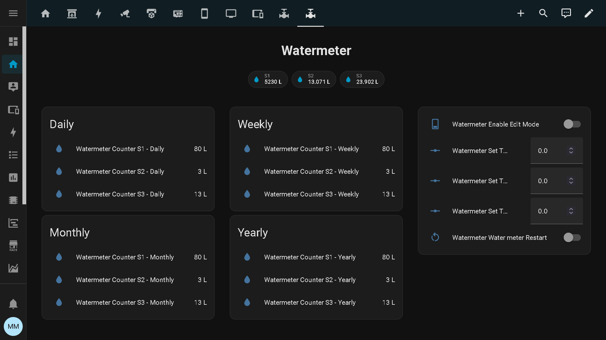
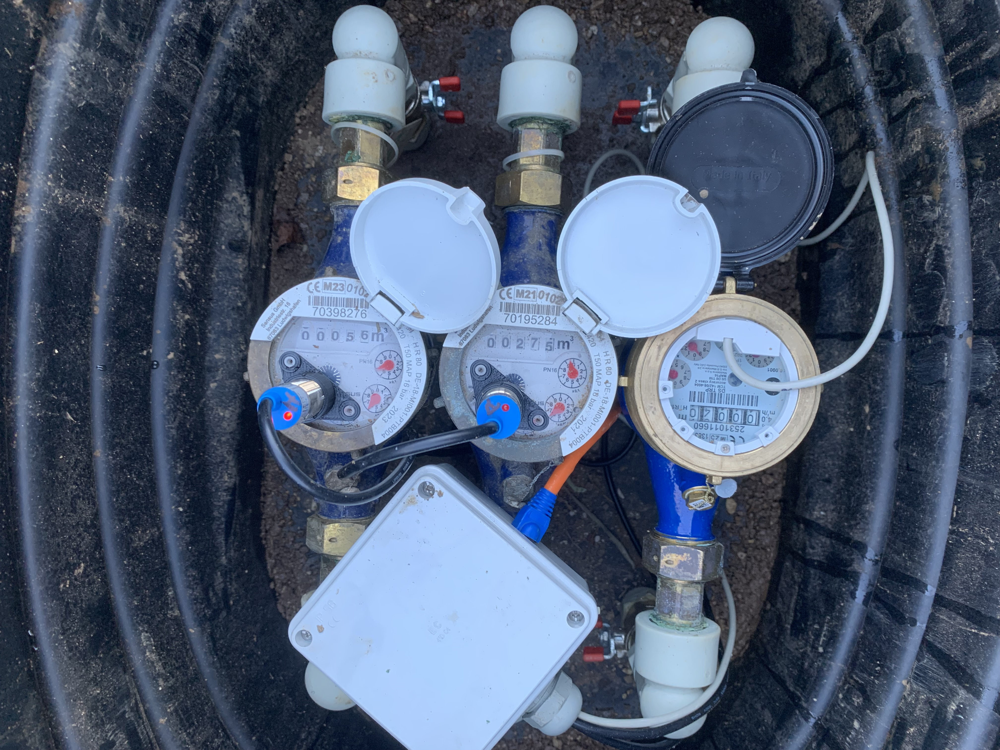
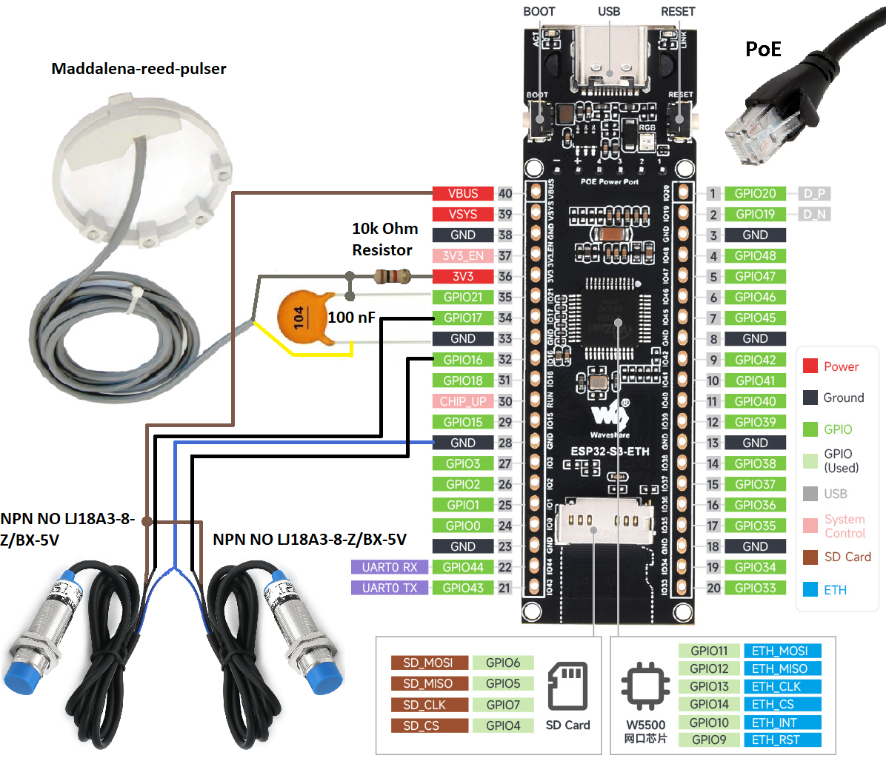
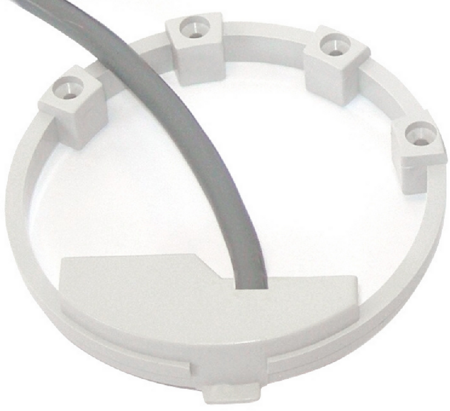

# 💧 ESPHome Triple Water Meter (ESP32-S3-POE-ETH)

🌐 Languages: [🇬🇧 English](README.md) | [🇸🇮 Slovenščina](README.sl.md)

## 📘 Overview
This project provides a complete **ESPHome configuration** for monitoring **three separate water meters** using an **ESP32-S3-POE-ETH** board with integrated **Power-over-Ethernet (PoE)** and **Ethernet (W5500)** support.

It is fully compatible with **Home Assistant**, but can also be monitored directly via the built-in **web server** using the device’s IP address.

<p>
  
  
</p>

---

## ⚡ Key Features
- Supports **three independent water meters**
- Designed for **PoE-powered ESP32-S3-POE-ETH** (no Wi-Fi needed)
- Works with **reed switches** or **NPN NO inductive sensors**
- Tracks **daily, weekly, monthly, and yearly** consumption
- Built-in **auto reset** at midnight, Monday, first of month/year
- Manual input for initial counter values
- Includes **web_server** for standalone monitoring
- **Restart switch** available via Home Assistant
- Stable and reliable — tested for several months in real use

---

## 🧠 Hardware Setup

### 🪛 Controller
- **ESP32-S3-POE-ETH** (with W5500 Ethernet + PoE module)  
  🔗 https://www.aliexpress.com/item/1005007945002026.html

---
### 🌐 Advantages of Using PoE

Using Power-over-Ethernet (PoE) provides a highly reliable and practical way to power the ESP32-S3-POE-ETH module:

✔ Stable power delivery over long distances — PoE works up to 100 meters without noticeable voltage drop or interference

✔ Single-cable installation — both power and data through the same Ethernet cable

✔ Improved reliability compared to Wi-Fi setups, especially for utility monitoring

✔ No need for local power adapters, outlets, or USB cables near the installation point

If you don’t have a PoE switch, you can still use PoE by adding a PoE injector, which provides power to the Ethernet cable while keeping the network connection simple and robust.

---

### 🔌 Wiring Schematics

Below is the complete wiring diagram used in this project:



*Detailed view of the ESP32-S3 connections, sensors, power routing, and Ethernet interface.*

---

## 💧 Water Meters and Sensors

### **S1 – Maddalena DS TRP**
- Uses **REED SWITCH TRP PULSER**

<p align="left">
  
</p>

- Includes hardware **debounce circuit**:
  - 100 nF ceramic capacitor (104)
  - 10 kΩ pull-up resistor

---

### **S2 and S3 – Sensus 420**
- Use **inductive NPN NO sensors (LJ18A3-8-Z/BX-5V)**  
  🔗 https://www.aliexpress.com/item/1005004867517992.html
- Powered at **5 V**
- Connected directly with internal pull-ups enabled in software:

```yaml
mode: INPUT_PULLUP
```

*Tested for several months — **no false triggers or interference**.*

---

## ⚙️ Software Details

### 🔌 Communication
- Ethernet (W5500)
- PoE power supply
- No Wi-Fi configuration required

---

### 📊 Data Points per Meter

Each meter (`S1`, `S2`, `S3`) provides the following sensors:

| Entity                  | Description                          |
| ----------------------- | ------------------------------------ |
| **Total**               | Lifetime total water usage (liters)  |
| **Daily**               | Reset every midnight                 |
| **Weekly**              | Reset every Monday                   |
| **Monthly**             | Reset on the 1st of each month       |
| **Yearly**              | Reset on January 1st                 |
| **Current consumption** | Tracks short-term water events       |
| **Last consumption**    | Holds most recent event before reset |

---

### 🔁 Automatic Resets

| Period  | Trigger Time       | Action                 |
| ------- | ------------------ | ---------------------- |
| Daily   | Every midnight     | Reset daily counters   |
| Weekly  | Monday at midnight | Reset weekly counters  |
| Monthly | 1st day of month   | Reset monthly counters |
| Yearly  | January 1st        | Reset yearly counters  |

---

## 🧮 Manual Initialization

If you need to set your water meter totals manually (for example when first installing the system), the firmware now includes a simple Edit Mode that enables manual input directly from Home Assistant or the web interface.

🟦 How It Works

Enable Edit Mode
Toggle the switch “Enable Edit Mode” to ON.
This unlocks the manual input fields.

Enter Initial Values
Adjust the values for:

Set Total S1

Set Total S2

Set Total S3

Enter the total water usage in liters as shown on your physical meters.

Apply the New Values
After entering the totals, toggle the “Restart” switch.
The device will reboot and load the new values as the starting point for all counters.

📝 Notes

Edit Mode automatically locks again after a reboot to prevent accidental changes.

If you need to correct values later, simply repeat the steps above.


---

## 🌐 Web Interface

The configuration includes a built-in **web server**.  
Once connected to the network, open your browser and visit:

```
http://<device_ip>
```

You’ll see live readings from all three water meters.

---

## 🔄 Restart Switch

A **software restart switch** is available through Home Assistant:

```yaml
switch:
  - platform: restart
    name: "Water meter Restart"
```
---


## 🛠 Installation Options

There are two ways to install the firmware onto your ESP32-S3-POE-ETH controller:

### 1️⃣ Install using the ESPHome Builder (recommended for Home Assistant users)
If you use Home Assistant and have ESPHome integrated, simply upload the provided YAML configuration into ESPHome and compile/flash the firmware directly from the ESPHome dashboard.

### 2️⃣ Install using the precompiled .BIN file (for users without Home Assistant)
For users who do **not** use Home Assistant, a ready-to-flash **`.bin` firmware file** is provided.

You can upload it directly to your controller using the official ESPHome web installer:

https://web.esphome.io/

Connect the ESP32-S3-POE-ETH via USB, open the page, click **Install**, choose the provided `.bin` file — and the device will be flashed.

After installation, you can monitor all three water meters through the built‑in **web interface**, without requiring Home Assistant.

---

## 🧰 Dependencies
* **ESPHome** ≥ 2024.6.0  
* **Home Assistant** (optional, but recommended)  
* Ethernet support enabled in your ESPHome installation  

---

## ⚖️ License
MIT License

---

## 🚀 Future Improvements
* MQTT support for integration with other systems  
* Flow rate calculation support  
* Adaptation for different ESP32 boards  
* Optional OLED display for local readings  

---

## 🙌 Credits
Developed and tested by **Mitja Modic**  
Inspired by real-world use for reliable water metering over Ethernet (PoE) connections.

---

⭐ *If you find this project useful, please give it a star on GitHub!* ⭐

### ☕ If you find this project useful and would like to support my work, you can buy me a coffee:

[](https://ko-fi.com/mitjamodic)